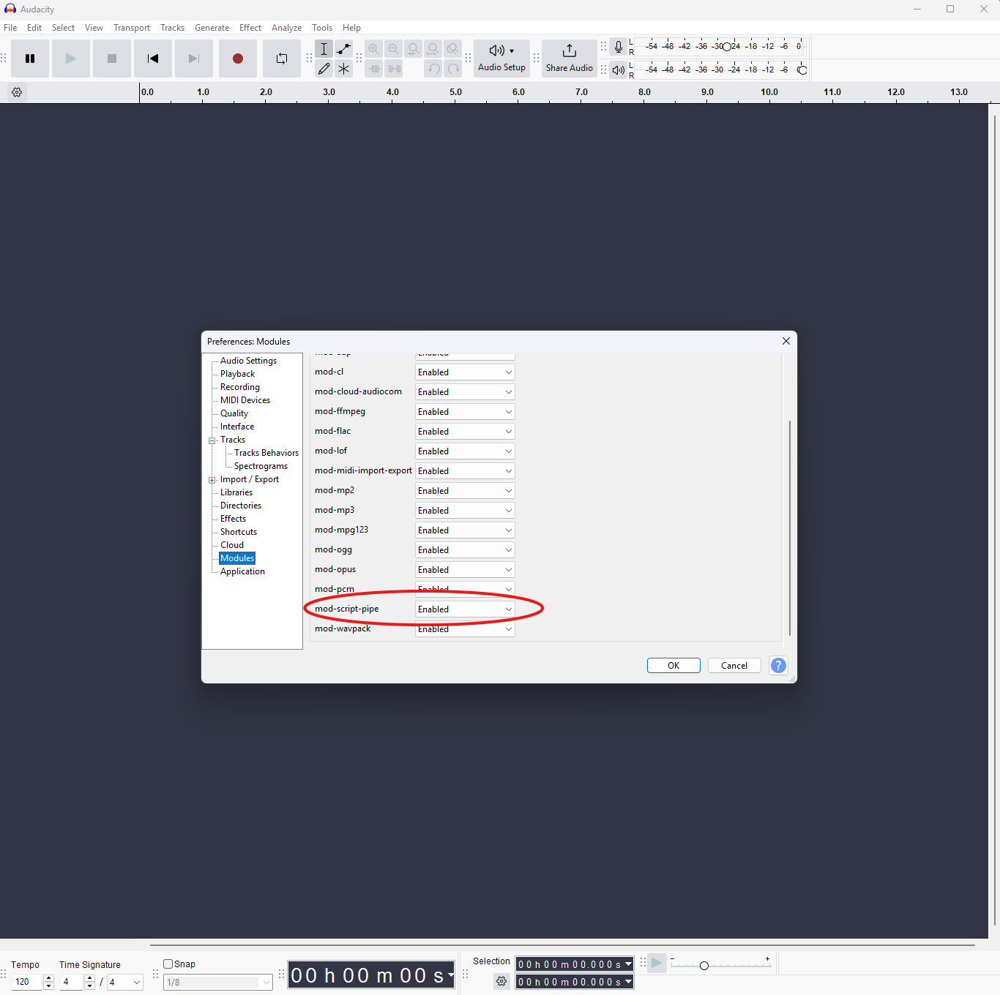

<h1 align="center">AudacityMCP</h1>

<p align="center">
  <strong>AI-powered audio editing in Audacity through the Model Context Protocol</strong>
</p>

<p align="center">
  <a href="https://www.python.org/"></a>
  <a href="LICENSE"></a>
  <a href="https://github.com/xDarkzx/Audacity-MCP/releases"></a>
  <a href="https://modelcontextprotocol.io"></a>
</p>

<p align="center">
  <a href="#quick-start">Quick Start</a> &bull;
  <a href="#why-audacitymcp">Why AudacityMCP?</a> &bull;
  <a href="#pipelines">Pipelines</a> &bull;
  <a href="docs/TOOLS.md">Tool Reference</a> &bull;
  <a href="#troubleshooting">Troubleshooting</a>
</p>

---

AudacityMCP connects any MCP-compatible AI assistant to [Audacity](https://www.audacityteam.org/), giving it full control over audio editing through 99 tools spanning effects, cleanup, mastering, transcription, and more. Talk to your AI assistant and it edits your audio in real-time.

**No cloud. No API keys for audio processing. Everything runs locally through Audacity's named pipe interface.**

### Works With

AudacityMCP works with any AI client that supports the [Model Context Protocol](https://modelcontextprotocol.io):

- [Claude Desktop](https://claude.ai/download) — Anthropic's desktop app
- [Claude Code](https://docs.anthropic.com/en/docs/claude-code) — CLI agent
- [Cursor](https://www.cursor.com/) — AI code editor with MCP support
- Any other [MCP-compatible client](https://modelcontextprotocol.io/clients)

---

## Quick Start

### 1. Enable mod-script-pipe in Audacity

Open Audacity → **Edit** → **Preferences** → **Modules** → set `mod-script-pipe` to **Enabled** → restart Audacity.

<p align="center">
  
</p>

> See [detailed instructions](docs/INSTALLATION.md#step-1-enable-mod-script-pipe-in-audacity) for more help.

### 2. Install AudacityMCP

```bash
git clone https://github.com/xDarkzx/Audacity-MCP.git
cd Audacity-MCP
pip install -e .
```

### 3. Configure your AI client

Add to your MCP client config (e.g. Claude Desktop's `claude_desktop_config.json`):

```json
{
  "mcpServers": {
    "audacity": {
      "command": "audacity-mcp"
    }
  }
}
```

<details>
<summary>Alternative: run from source</summary>

```json
{
  "mcpServers": {
    "audacity": {
      "command": "python",
      "args": ["-m", "server.main"],
      "cwd": "/path/to/Audacity-MCP"
    }
  }
}
```

</details>

### 4. Start editing

Open Audacity, load some audio, then talk to your AI:

```
"Clean up this podcast recording"
"Master this track for Spotify, it's EDM"
"Transcribe this and add labels at each sentence"
"Add reverb with a large room, then export as FLAC"
```

> **Audacity must be open first.** AudacityMCP communicates through Audacity's named pipe — it can't launch Audacity for you.

> See the full [Installation Guide](docs/INSTALLATION.md) for detailed setup on all platforms and MCP clients.

---

## Why AudacityMCP?

**Without AudacityMCP:** You manually navigate menus, tweak effect parameters by ear, apply effects one at a time, look up ACX specs, and repeat until it sounds right.

**With AudacityMCP:** You describe what you want in plain English and the AI handles the rest — picking the right effects, setting industry-standard parameters, and chaining operations together.

| | Manual Audacity | With AudacityMCP |
|---|---|---|
| **Podcast cleanup** | 5+ steps across different menus, guessing compressor settings | *"Clean up this podcast"* — one sentence |
| **Music mastering** | Research genre-appropriate EQ/compression, apply each manually | *"Master this for Spotify, it's hip-hop"* — genre-tuned presets |
| **Noise removal** | Effect → Noise Reduction → Get Profile → select all → apply | *"Remove the background noise"* — automatic profiling |
| **Batch operations** | Repetitive menu navigation for each operation | Describe the full chain and watch it happen |
| **Transcription** | Export audio, use external tool, import results back | *"Transcribe this and add labels"* — stays in Audacity |
| **Learning curve** | Know which effects exist and what parameters to use | Just describe the result you want |

AudacityMCP is especially useful for:
- **Podcasters** who want consistent, professional sound without audio engineering knowledge
- **Musicians** who need quick mastering with genre-appropriate settings
- **Content creators** working with interviews, voiceovers, or field recordings
- **Anyone** who'd rather describe what they want than click through menus

---

## What Can It Do?

```
You:  "Clean up this podcast recording"
AI:   Runs auto_cleanup_podcast → HPF 80Hz → noise reduction → compression → safe loudness check

You:  "Master this track for Spotify, it's EDM"
AI:   Runs auto_master_music style=edm → HPF 30Hz → click removal → compression 2.5:1 → bass +2dB → loudness check

You:  "This is a noisy live recording, fix it up"
AI:   Runs auto_cleanup_live → HPF 100Hz → click removal → noise reduction 18dB → compression 5:1

You:  "Transcribe this interview and add labels"
AI:   Runs transcribe_to_labels → faster-whisper transcription → Audacity labels at each timestamp

You:  "Add reverb to the vocals, then export as FLAC"
AI:   select region → reverb effect → export to FLAC
```

## Features

### 99 Tools Across 11 Categories

| Category | Tools | Highlights |
|----------|-------|------------|
| **Effects** | 17 | Reverb, echo, pitch shift, tempo change, EQ, phaser, distortion, paulstretch, HPF/LPF, bass & treble |
| **Cleanup & Mastering** | 18 | Noise reduction, compressor, 9 one-click pipelines, analysis tool |
| **Editing** | 9 | Cut, copy, paste, split, join, trim, silence, duplicate |
| **Project** | 10 | New, open, save, import/export (WAV, MP3, FLAC, OGG, AIFF) |
| **Track** | 8 | Add mono/stereo, remove, set properties, mix & render, mute/solo |
| **Selection** | 7 | Select all/none/region/tracks, zero crossing, cursor positioning |
| **Transport** | 7 | Play, stop, pause, record, play region, get position |
| **Analysis** | 6 | Contrast, clipping detection, spectrum, beat finder, sound labeling |
| **Generation** | 5 | Tone, noise, chirp, DTMF, rhythm track |
| **Transcription** (Experimental) | 7 | Full/selection transcribe, to labels, to SRT/VTT/TXT, model preload |
| **Labels** | 5 | Add, add at time, get all, import/export |

---

## Pipelines

AudacityMCP includes 9 one-click pipelines for common audio tasks. Each pipeline is designed to be **safe for badly recorded audio** — it will never boost your audio dangerously. Pipelines clean up and improve your audio, then you can manually adjust loudness afterward if needed.

### How Pipelines Work

1. You tell the AI what you want (e.g. "clean up this podcast")
2. The AI picks the right pipeline and starts it
3. The pipeline runs in the background — you get a `job_id` back
4. Poll with `check_pipeline_status` every 15-30 seconds to monitor progress
5. When done, a popup appears in Audacity

> **Safety rule:** Pipelines only **reduce** peaks if they're too hot. They **never boost** loudness. If you want to hit a specific LUFS target (e.g. -14 for Spotify), ask the AI to run `loudness_normalize` after you've checked the results look good.

### Pipeline Reference

#### `auto_analyze_audio` — Analyze before processing

Measures your audio and recommends the best pipeline. Run this first if you're not sure what to do.

```
You: "Analyze this audio"
→ Returns: peak level, noise floor, clipping status, recommended pipeline
```

#### `auto_cleanup_audio` — Safe cleanup only

Cleans up noise and artifacts **without changing loudness at all**. Use when levels are already fine.

```
You: "Just clean up the noise, don't change the volume"
→ DC offset removal → HPF 80Hz → noise reduction → click removal (optional)
```

#### `auto_cleanup_podcast` — Podcast / voiceover

Professional broadcast processing for spoken word.

```
You: "Clean up this podcast recording"
→ DC offset → HPF 80Hz → noise reduction 12dB → compression 3:1 → safe loudness check
```

#### `auto_audiobook_mastering` — Audiobook (ACX/Audible)

Targets ACX requirements for audiobook distribution.

```
You: "Master this for ACX / Audible"
→ DC offset → HPF 80Hz → noise reduction 12dB → compression 2.5:1 → safe loudness check → peak cap -3dB
```

#### `auto_cleanup_interview` — Interview / dialogue

Light touch for conversations — preserves natural dynamics.

```
You: "Clean up this interview recording"
→ DC offset → HPF 80Hz → noise reduction 8dB → compression 2.5:1 → safe loudness check
```

#### `auto_cleanup_vocal` — Singing / studio vocal

Tuned for vocal recordings with presence EQ for clarity.

```
You: "Process this vocal recording"
→ DC offset → HPF 100Hz → noise reduction 10dB → compression 3:1 → presence EQ (+3dB treble, -1dB bass) → safe loudness check
```

#### `auto_cleanup_live` — Live / field / noisy recording

Aggressive cleanup for noisy environments. First 0.5s **must** be ambient noise for profiling.

```
You: "This is a noisy live recording, clean it up"
→ DC offset → HPF 100Hz → click removal → noise reduction 18dB → compression 5:1 → safe loudness check
```

#### `auto_master_music` — Music mastering

Genre-tuned mastering with 6 presets: `edm`, `hiphop`, `rock`, `pop`, `classical`, `acoustic`.

```
You: "Master this hip-hop track"
→ HPF 30Hz → click removal → compression 2:1 → bass +3dB treble +1dB → safe loudness check

You: "Master this for a classical album"
→ HPF 30Hz → click removal → compression 1.3:1 (very gentle) → no EQ → safe loudness check
```

| Preset | HPF | Compression | Bass EQ | Treble EQ |
|--------|-----|-------------|---------|-----------|
| **EDM** | 30 Hz | 2.5:1 / 80ms | +2 dB | +1 dB |
| **Hip-Hop** | 30 Hz | 2:1 / 100ms | +3 dB | +1 dB |
| **Rock** | 40 Hz | 2:1 / 100ms | 0 dB | +1 dB |
| **Pop** | 35 Hz | 2:1 / 80ms | +1 dB | +1.5 dB |
| **Classical** | 30 Hz | 1.3:1 / 200ms | 0 dB | 0 dB |
| **Acoustic** | 30 Hz | 1.5:1 / 150ms | 0 dB | 0 dB |

#### `auto_lofi_effect` — Creative lo-fi / vintage

Apply a warm, vintage lo-fi sound. Presets: `light`, `medium`, `heavy`.

```
You: "Give this a lo-fi vibe"
→ HPF → LPF (muffled highs) → bass/treble warmth → compression 2:1 → safe loudness check
```

### After a Pipeline: Adjusting Loudness

Pipelines intentionally leave loudness alone (they only reduce if peaks are clipping). To hit a streaming target:

```
You: "Now normalize this to -14 LUFS for Spotify"
→ AI uses loudness_normalize tool with lufs_level=-14

You: "Normalize to -16 LUFS for podcast"
→ AI uses loudness_normalize tool with lufs_level=-16
```

> **Why not do this automatically?** LUFS normalization can boost quiet/badly recorded audio by 10-20 dB, which blows it out. By separating cleanup from loudness, you get to check the results before the final loudness step.

---

### Local Transcription (Experimental)

> **This feature is experimental** and requires separate setup. Everything else works without it.

Powered by [faster-whisper](https://github.com/SYSTRAN/faster-whisper) — runs entirely offline, your audio never leaves your machine:

- 5 model sizes: `tiny`, `base`, `small`, `medium`, `large-v3`
- Transcribe full audio or just a selection
- Export as SRT, VTT, or plain text subtitles
- Auto-add Audacity labels at each spoken segment
- Language detection or specify 99+ languages

> **Setup required before first use:** See [Transcription Setup](docs/INSTALLATION.md#transcription-setup-optional) for installation steps.

---

## What's New — v0.1.1

Security hardening and bug fixes. [Full changelog →](CHANGELOG.md)

- **Security**: Path traversal protection, command injection fix, file overwrite protection
- **Fixed**: `select_zero_crossing` called wrong command, `auto_analyze_audio` track parsing broken, transcription export incomplete on multi-track, error messages lost on failure
- **Validation**: Range checks on 6 effects, 3 generators, 2 analyzers — bad values no longer crash Audacity
- **Reliability**: Memory leak fix, race condition fix, thread-safe model loading, stale job timeouts
- **Tests**: 41 → 60 tests

---

## Troubleshooting

### Connection Issues

| Problem | Fix |
|---------|-----|
| "Pipe not found" | Open Audacity first. Make sure `mod-script-pipe` is enabled in Edit → Preferences → Modules. Restart Audacity after enabling. |
| "Pipe timeout" | Audacity is busy. Wait for it to finish — some effects take minutes on long files. |
| Connection works once then fails | The pipe disconnected (Audacity crash or restart). Just try again — AudacityMCP auto-reconnects. |
| "Access denied" (Windows) | Audacity and your AI client must run as the same user. Don't mix admin and non-admin. |

### Pipeline Issues

| Problem | Fix |
|---------|-----|
| Pipeline blows out / clips the audio | This shouldn't happen anymore — pipelines only reduce peaks, never boost. If it does, undo (Ctrl+Z) and report the issue. |
| "A pipeline is already running" | Only one pipeline can run at a time. Use `check_pipeline_status` with your job_id to monitor the current one. |
| Pipeline finishes but audio is too quiet | That's by design — pipelines don't boost. Ask the AI: "Normalize to -14 LUFS" after checking results. |
| Noise reduction sounds metallic/warbled | The first 0.5 seconds of your track must be pure silence/room noise for profiling. If it's not, trim to add silence or use `auto_cleanup_audio` with `remove_noise=False`. |
| Pipeline step failed (in warnings) | Individual steps can fail without stopping the pipeline. Check the `warnings` field in `check_pipeline_status` for details. |

### Audio Quality Tips

| Want | Do This |
|------|---------|
| Remove background noise | Make sure the first 0.5s of your track is pure room tone (no speech/music). The pipeline uses this to build a noise profile. |
| Fix clipping | Run `auto_analyze_audio` first. If it detects clipping, use `auto_cleanup_audio` before other pipelines. |
| Hit -14 LUFS for Spotify | Run a cleanup pipeline first, check the results look good, then ask the AI to apply `loudness_normalize` at -14 LUFS. |
| Hit -16 LUFS for podcast | Same approach — cleanup first, LUFS second. |
| ACX audiobook compliance | Use `auto_audiobook_mastering`. It targets RMS -20 dB with a -3 dB peak cap. |
| Quick cleanup without changing volume | Use `auto_cleanup_audio` — it only removes noise and artifacts, no loudness changes. |

### General Issues

| Problem | Fix |
|---------|-----|
| "No module named faster_whisper" | Run `pip install faster-whisper`. Transcription is optional — everything else works without it. |
| Model download fails | Check internet and retry. Models cache locally after first download. |
| Pipes missing in /tmp (macOS/Linux) | Check Audacity is running and mod-script-pipe is enabled. Check Audacity's console for errors. |

---

## Architecture

```
┌──────────────┐     stdio      ┌──────────────┐   named pipe   ┌──────────────┐
│  MCP Client  │◄──────────────►│ AudacityMCP  │◄──────────────►│   Audacity   │
│(AI assistant)│    (JSON-RPC)  │   FastMCP    │  (commands)    │              │
└──────────────┘                └──────────────┘                └──────────────┘
                                       │
                                       ├── server/main.py          (entry point)
                                       ├── server/audacity_client.py (pipe I/O)
                                       ├── server/tool_registry.py  (auto-loader)
                                       └── server/tools/            (11 modules)
```

### Key Design Decisions

- **Named pipes, not TCP** — Direct IPC to Audacity's `mod-script-pipe`. No network exposure, no port conflicts.
- **Zero `exec`/`eval`** — Every operation maps to a static handler with input validation. No arbitrary code execution.
- **Cross-platform** — Windows uses Win32 API via ctypes, Unix uses standard file I/O.
- **Async throughout** — All tool handlers are `async`. Blocking pipe I/O runs in an executor pool with configurable timeouts.
- **Safe pipelines** — Pipelines measure audio before making loudness decisions. They only reduce, never boost.
- **Dynamic tool registration** — Drop a module in `server/tools/`, export a `register(mcp)` function, and it's automatically discovered.

### Project Structure

```
AudacityMCP/
├── server/
│   ├── main.py                 # FastMCP server entry point
│   ├── audacity_client.py      # Cross-platform named pipe client
│   ├── tool_registry.py        # Auto-discovers and registers tool modules
│   └── tools/
│       ├── analysis_tools.py   # Audio analysis (contrast, spectrum, beats)
│       ├── cleanup_tools.py    # Noise reduction, mastering, 9 pipelines
│       ├── edit_tools.py       # Cut, copy, paste, split, join, trim
│       ├── effects_tools.py    # Reverb, echo, pitch, EQ, filters
│       ├── generate_tools.py   # Tone, noise, chirp, DTMF generation
│       ├── label_tools.py      # Label management
│       ├── project_tools.py    # Project/file operations
│       ├── selection_tools.py  # Selection and cursor control
│       ├── track_tools.py      # Track management
│       ├── transcription_tools.py  # Whisper-based transcription
│       └── transport_tools.py  # Playback and recording control
├── shared/
│   ├── constants.py            # Pipe paths, timeouts, allowed formats
│   ├── error_codes.py          # Typed error codes (pipe/command/validation)
│   └── pipe_protocol.py        # Command formatting and response parsing
├── tests/                      # 60 tests
├── docs/
│   ├── INSTALLATION.md         # Detailed setup guide
│   └── TOOLS.md                # Complete tool reference
└── pyproject.toml
```

---

## Development

```bash
# Install dev dependencies
pip install -e ".[dev]"

# Run tests
pytest tests/ -x -q
```

### Adding New Tools

1. Create a module in `server/tools/` (or add to an existing one)
2. Export a `register(mcp: FastMCP)` function
3. Define your tools with `@mcp.tool()` decorators
4. That's it — the tool registry auto-discovers it on startup

```python
# server/tools/my_tools.py
from mcp.server.fastmcp import FastMCP
from shared.error_codes import AudacityMCPError, ErrorCode


def register(mcp: FastMCP):
    from server.main import client

    @mcp.tool()
    async def my_custom_effect(intensity: float = 0.5) -> dict:
        """Apply my custom effect to the selected audio."""
        if not 0 <= intensity <= 1:
            raise AudacityMCPError(ErrorCode.VALUE_OUT_OF_RANGE, "intensity must be 0-1")
        return await client.execute_long("MyEffect", Intensity=intensity)
```

See [CONTRIBUTING.md](CONTRIBUTING.md) for full guidelines.

---

## Support

If AudacityMCP has saved you time or helped with your audio projects, consider buying me a coffee:

<p align="center">
  <a href="https://buymeacoffee.com/xdarkzx">
    
  </a>
</p>

Your support helps keep this project maintained and free for everyone.

---

## Documentation

- **[Installation Guide](docs/INSTALLATION.md)** — Detailed setup for Windows, macOS, Linux
- **[Tool Reference](docs/TOOLS.md)** — Complete reference for all 99 tools with parameters
- **[Contributing](CONTRIBUTING.md)** — How to add tools and contribute
- **[Changelog](CHANGELOG.md)** — Version history and release notes

## License

Apache License 2.0 — see [LICENSE](LICENSE) for details.

Built by [Daniel Hodgetts](https://github.com/xDarkzx) &bull; [𝕏 @daehonz1](https://x.com/daehonz1)
